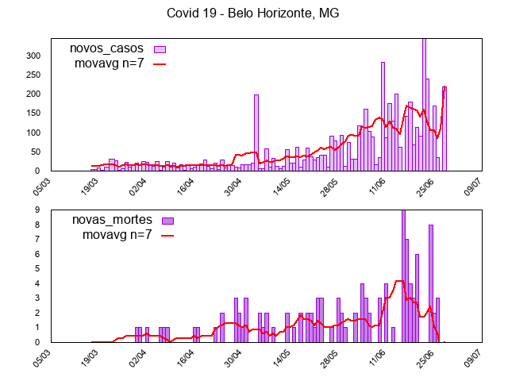

# covidbr
Covid 19 Brasil

O script utiliza os dados de https://brasil.io/ para criar os gráficos de novos casos/mortes para a cidade desejada.

Modos de utilização:

```
./covid.sh -c 'Belo Horizonte' -s 'MG' -n 7
```


